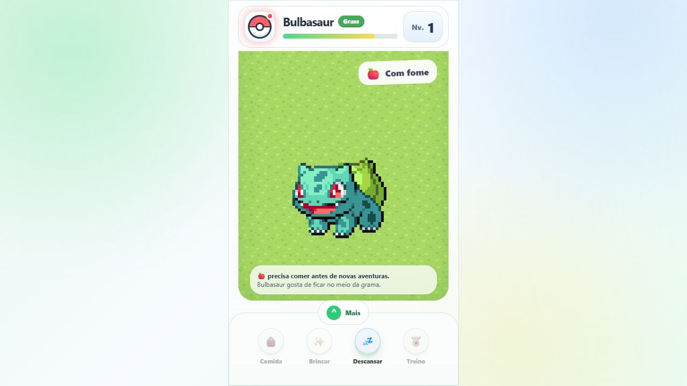

# SuperPokégochi

Tamagotchi de Pokémon feito com HTML, CSS e JavaScript puro. O projeto funciona
sozinho, sem backend ou compilação, e salva o progresso no navegador com
`localStorage`.



## O que já funciona

- Catálogo pesquisável com 1.025 espécies.
- Escolha de qualquer Pokémon do catálogo.
- Evoluções escolhidas pela primeira vez começam na forma inicial da linha.
- Nível, XP, vínculo e cuidados compartilhados pela linha evolutiva.
- Evolução opcional e troca livre entre as formas desbloqueadas.
- Sprites normais e Shiny animados em um gramado responsivo.
- Escala inteira de pixels para sprites mais nítidos em celulares.
- Animações automáticas, respeitando a preferência de movimento reduzido do aparelho.
- Cinco músicas de fundo com controle de volume no gramado.
- Fome, felicidade, energia, nível, XP e dias de vínculo.
- Comida, brincadeira, treino, descanso, mochila e histórico.
- Frutas e ícones de cuidados em pixel art.
- Folhas e frutas coletáveis que aparecem periodicamente no gramado.
- Sujeira acumulada depois de um dia sem cuidados, removida com um clique.
- Recompensa diária e ciclo de dia e noite no horário de Brasília.
- Aparência Shiny liberada com 30 dias de vínculo.
- Salvamento automático no navegador.

## Executar

Abra `index.html` diretamente ou inicie um servidor local:

```bash
python -m http.server 5182
```

Depois acesse `http://127.0.0.1:5182/`.

## Como cuidar e ganhar XP

| Ação | Resultado |
| --- | --- |
| Frutas | Recuperam fome e concedem de 4 a 8 XP |
| Brincar | Aumenta a felicidade, concede 6 XP e gasta 6 de energia |
| Treino | Minigame de três rodadas e principal fonte de XP |
| Descansar | Recupera 12 de energia e concede 3 XP a cada 30 minutos |
| Coletar folha | Concede 2 XP; até dez folhas podem ficar no gramado |
| Coletar fruta | Guarda a fruta encontrada na mochila |

O XP do descanso considera o tempo transcorrido mesmo quando o jogo está
fechado. Cada período já recompensado fica registrado para não conceder o mesmo
XP duas vezes.

Brincar fica disponível com pelo menos 8 de energia, e o treino exige mais de
18 de energia e 15 de fome. Ele ainda pode comer enquanto estiver acordado. Durante o descanso,
as demais ações ficam bloqueadas, mas o treinador pode encerrá-lo manualmente.

As necessidades diminuem lentamente com o tempo: fome em 2,5 pontos, felicidade
em 1 ponto e energia em 1,25 ponto por hora. Depois de aproximadamente 24 horas
sem cuidados, aparece sujeira no gramado. Clique nela para limpar; essa ação não
concede XP.

## Evolução e progresso compartilhado

O progresso pertence à linha evolutiva inteira, não a cada aparência.

```text
Ralts → Kirlia → Gardevoir
Nível compartilhado: 100
```

Ao alcançar o requisito, o treinador pode evoluir imediatamente ou continuar
com a forma atual. Depois de desbloqueada, qualquer forma da linha pode ser
usada novamente sem perder nível, XP, vínculo ou cuidados.

No catálogo completo, cada estágio evolutivo adicional é liberado a cada 16
níveis. Algumas linhas destacadas podem possuir configuração própria.

## Como trocar de Pokémon

Abra a **Pokébola no topo**, entre na aba **Pokémon** e escolha **Alterar Pokémon
companheiro**. A busca aceita nome, identificador ou número da Pokédex, como
`Pikachu`, `pikachu`, `25` ou `#025`.

Se uma evolução for escolhida e sua linha nunca tiver sido treinada, o cuidado
começa pela forma inicial. Se aquela forma já tiver sido desbloqueada, o jogo
recupera o progresso da linha e pode exibi-la imediatamente.

Os ícones de formas bloqueadas aparecem em cinza para facilitar a identificação.

## Animações e nitidez

As animações funcionam automaticamente e seguem a preferência de movimento
reduzido do aparelho. Para poupar recursos em celulares, as miniaturas do
catálogo ficam paradas, enquanto o companheiro principal continua animado quando
o aparelho permite movimento.

## Música de fundo

O botão de volume no canto superior esquerdo do gramado liga ou desliga a
música. Ao abrir o SuperPokégochi, a faixa inicial é sorteada; depois, as cinco
faixas seguem em sequência com volume suave, definido em 14%.

Alguns navegadores só permitem iniciar o áudio depois que o usuário interage
com a página. A preferência e a faixa atual ficam salvas no `localStorage`.

## Arquivos principais

```text
.
|-- assets/
|   |-- arrow-ios-back.svg
|   |-- grass.png
|   |-- items/
|   |-- musics/
|   |-- superpokegochi-preview.png
|   `-- pokemons/
|       |-- Front/
|       |-- Front shiny/
|       `-- front-index.json
|-- index.html
|-- pokemon-catalog.js
|-- pokemon-data.js
|-- tamagotchi-system.js
|-- style.css
|-- scripts/
|   `-- generate-pokemon-catalog.mjs
`-- README.md
```

Para atualizar o catálogo depois de adicionar novos sprites:

```bash
node scripts/generate-pokemon-catalog.mjs
```

## Aviso

Projeto de fãs, sem afiliação oficial com Nintendo, Game Freak ou The Pokémon
Company. Pokémon e seus personagens pertencem aos respectivos detentores.
